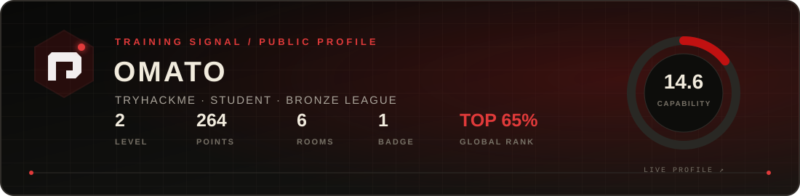

<div align="center">
  <a href="https://omatomato.github.io">
    
  </a>
</div>

<br />

<div align="center">

[](https://omatomato.github.io)
[](https://tryhackme.com/p/omato)
[](https://omatomato.github.io/cases/)
[](https://omatomato.github.io/trust/cryptography/)

<h3>Security research from the signal up.</h3>

<p>
  OSINT · incident response · detection engineering · privacy · digital investigations
</p>

</div>

---

<table>
  <tr>
    <td width="58%" valign="top">
      <h3>◉ Operator profile</h3>
      <p>
        I turn fragmented technical and public signals into timelines,
        evidence maps, detection logic, and decisions that can be independently checked.
      </p>
      <p>
        Public work is deliberately redacted. Facts, inference, confidence,
        and limits stay visibly separate.
      </p>
    </td>
    <td width="42%" valign="top">
      <h3>⌁ Current vector</h3>
      <pre>RESEARCH   threat & fraud patterns
BUILD      local-first security tools
DETECT     SIEM / EDR / telemetry
VERIFY     evidence & cryptography</pre>
    </td>
  </tr>
</table>

## Training ground

<div align="center">
  <a href="https://tryhackme.com/p/omato">
    
  </a>
  <br />
  <sub>Public profile snapshot · July 2026 · click the card for live progress</sub>
</div>

## Selected work

<table>
  <tr>
    <td width="50%" valign="top">
      <h3><a href="https://omatomato.github.io">01 / Omatomato Field Lab ↗</a></h3>
      <p>
        Privacy-first portfolio and browser-based field desk for evidence preparation,
        IOC triage, threat modeling, secure contact, and public research.
      </p>
      <p><code>TypeScript</code> <code>Next.js</code> <code>Local-first</code> <code>LIVE</code></p>
    </td>
    <td width="50%" valign="top">
      <h3><a href="https://github.com/omatomato/Fraud-Investigation">02 / Fraud Investigation ↗</a></h3>
      <p>
        Redacted case study of a multi-stage JavaScript injection campaign,
        combining OSINT, infrastructure analysis, threat hunting, and on-chain tracing.
      </p>
      <p><code>OSINT</code> <code>Threat Intel</code> <code>On-chain</code> <code>CASE STUDY</code></p>
    </td>
  </tr>
  <tr>
    <td width="50%" valign="top">
      <h3><a href="https://github.com/omatomato/soc-lab">03 / SOC Lab ↗</a></h3>
      <p>
        Isolated APT simulation with Sysmon telemetry, Wazuh detection,
        Sigma rules, MITRE ATT&amp;CK mapping, and automated response exercises.
      </p>
      <p><code>Wazuh</code> <code>Sysmon</code> <code>SOAR</code> <code>LAB</code></p>
    </td>
    <td width="50%" valign="top">
      <h3><a href="https://github.com/omatomato/Security-Utils">04 / Security Utils ↗</a></h3>
      <p>
        Java 21 learning toolkit for password generation and analysis,
        hashing, file integrity checks, and local encryption experiments.
      </p>
      <p><code>Java 21</code> <code>Maven</code> <code>Cryptography</code> <code>LEARNING</code></p>
    </td>
  </tr>
</table>

## Field doctrine

```text
01  COLLECT      preserve the original signal and its context
02  CORRELATE    build a timeline before building a narrative
03  CHALLENGE    test competing explanations and negative controls
04  COMMUNICATE  separate fact, inference, confidence, and limitation
05  PROTECT      minimize exposure of people, sources, and raw evidence
```

## Technical surface

<div align="center">


</div>

<table>
  <tr>
    <td width="33%" align="center">
      <strong>INVESTIGATE</strong><br />
      <sub>OSINT · timelines · attribution limits</sub>
    </td>
    <td width="34%" align="center">
      <strong>DEFEND</strong><br />
      <sub>telemetry · detections · response</sub>
    </td>
    <td width="33%" align="center">
      <strong>ENGINEER</strong><br />
      <sub>local tools · privacy · verification</sub>
    </td>
  </tr>
</table>

## Trust, contact & verification

```text
PGP  2B43 C0CE 100D 8B6F 76FB C2BB 765C 151A 678A 5A34
```

<div align="center">

[Public key](https://omatomato.github.io/omatomato-public-key.asc) ·
[Security policy](https://omatomato.github.io/security-policy/) ·
[Secure contact](https://omatomato.github.io/contact/) ·
[Field notes](https://omatomato.github.io/notes/)

<br /><br />

<sub>TRACE THE SIGNAL · PROVE THE PATTERN · PROTECT THE SOURCE</sub>

</div>
