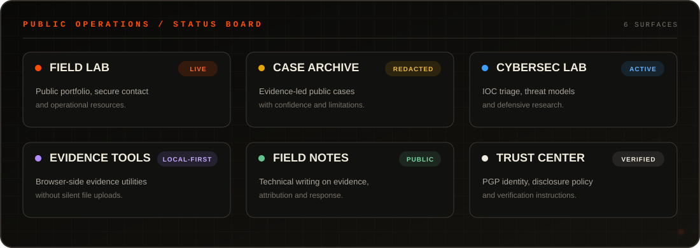
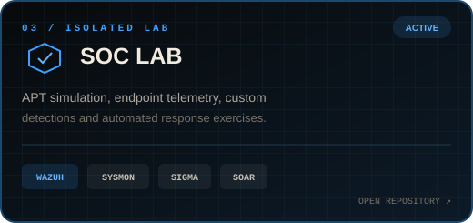
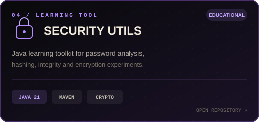
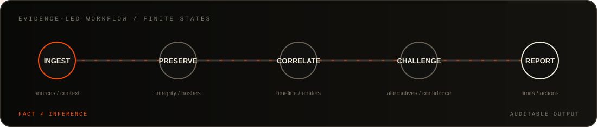

<div align="center">
  <a href="https://omatomato.github.io">
    
  </a>
</div>

<div align="center">

[](https://omatomato.github.io)
[](https://tryhackme.com/p/omato)
[](https://omatomato.github.io/cases/)
[](https://omatomato.github.io/trust/cryptography/)

<br />


</div>

## Independent security research & defensive engineering

<table>
  <tr>
    <td width="58%" valign="top">
      <h3>Operator profile</h3>
      <p>
        I investigate public and lawfully supplied technical signals, organize
        them into reproducible timelines, and turn findings into detection,
        response, or risk-reduction work.
      </p>
      <p>
        Published material is redacted. Verified facts, inference, confidence,
        and limitations remain distinct.
      </p>
    </td>
    <td width="42%" valign="top">
      <h3>Active disciplines</h3>
      <pre>OSINT       infrastructure & identity
SOC         telemetry & detections
IR          triage & evidence
PRIVACY     exposure reduction
DEV         local-first tools</pre>
    </td>
  </tr>
</table>

## Public operations surface

<div align="center">
  <a href="https://omatomato.github.io">
    
  </a>
  <br />
  <sub>
    <a href="https://omatomato.github.io/cases/">Cases</a> ·
    <a href="https://omatomato.github.io/lab/">Cybersec Lab</a> ·
    <a href="https://omatomato.github.io/tools/">Evidence Tools</a> ·
    <a href="https://omatomato.github.io/notes/">Field Notes</a> ·
    <a href="https://omatomato.github.io/trust/">Trust Center</a>
  </sub>
</div>

## Selected repositories

<table>
  <tr>
    <td width="50%">
      <a href="https://github.com/omatomato/omatomato.github.io">
        
      </a>
    </td>
    <td width="50%">
      <a href="https://github.com/omatomato/Fraud-Investigation">
        
      </a>
    </td>
  </tr>
  <tr>
    <td width="50%">
      <a href="https://github.com/omatomato/soc-lab">
        
      </a>
    </td>
    <td width="50%">
      <a href="https://github.com/omatomato/Security-Utils">
        
      </a>
    </td>
  </tr>
</table>

## TryHackMe

<div align="center">

[](https://tryhackme.com/p/omato)

`LEVEL 2` · `BRONZE LEAGUE` · `264 POINTS` · `6 ROOMS` · `1 BADGE` · `TOP 65%`

<sub>Public profile data checked in July 2026. The link above opens the live TryHackMe record.</sub>

</div>

## Investigation workflow

<div align="center">
  
</div>

<details>
<summary><strong>Research and investigation</strong></summary>
<br />

`OSINT` · `Infrastructure analysis` · `Timeline reconstruction` ·
`Transaction graphs` · `Threat intelligence` · `Evidence handling`

</details>

<details>
<summary><strong>Detection and response</strong></summary>
<br />

`Wazuh` · `Sysmon` · `Sigma` · `MITRE ATT&CK` ·
`Alert triage` · `Incident response` · `SOAR exercises`

</details>

<details>
<summary><strong>Engineering and tooling</strong></summary>
<br />

`Linux` · `Python` · `TypeScript` · `React` · `Next.js` ·
`Java` · `SQL` · `Docker` · `Git` · `GitHub Actions`

</details>

## Stack

<div align="center">


<br /><br />


</div>

## Identity & secure contact

```text
PGP  2B43 C0CE 100D 8B6F 76FB C2BB 765C 151A 678A 5A34
```

<div align="center">

[Public key](https://omatomato.github.io/omatomato-public-key.asc) ·
[Security policy](https://omatomato.github.io/security-policy/) ·
[Secure contact](https://omatomato.github.io/contact/) ·
[Incident first steps](https://omatomato.github.io/incident/)

</div>
