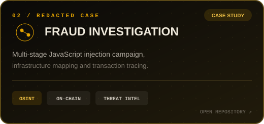
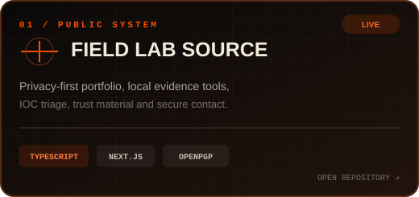

<div align="center">
  <a href="https://omatomato.github.io">
    
  </a>
</div>

<div align="center">

[](https://omatomato.github.io)
[](https://tryhackme.com/p/omato)
[](https://omatomato.github.io/cases/)
[](https://omatomato.github.io/trust/cryptography/)

</div>

## Security research & defensive engineering

OSINT, digital investigations, detection engineering and incident response.
Public work is documented with reproducible evidence, explicit limitations and sensitive data removed.

## Selected work

<table>
  <tr>
    <td width="50%">
      <a href="https://github.com/omatomato/Fraud-Investigation">
        
      </a>
    </td>
    <td width="50%">
      <a href="https://github.com/omatomato/omatomato.github.io">
        
      </a>
    </td>
  </tr>
</table>

## Focus & tools

<div align="center">

`OSINT` · `Infrastructure analysis` · `Evidence handling` · `Threat intelligence`
<br />
`Wazuh` · `Sysmon` · `Sigma` · `MITRE ATT&CK` · `Incident response`

<br />


</div>

## Verification

```text
PGP  2B43 C0CE 100D 8B6F 76FB C2BB 765C 151A 678A 5A34
```

<div align="center">

[Public key](https://omatomato.github.io/omatomato-public-key.asc) ·
[Security policy](https://omatomato.github.io/security-policy/) ·
[Secure contact](https://omatomato.github.io/contact/)

</div>
